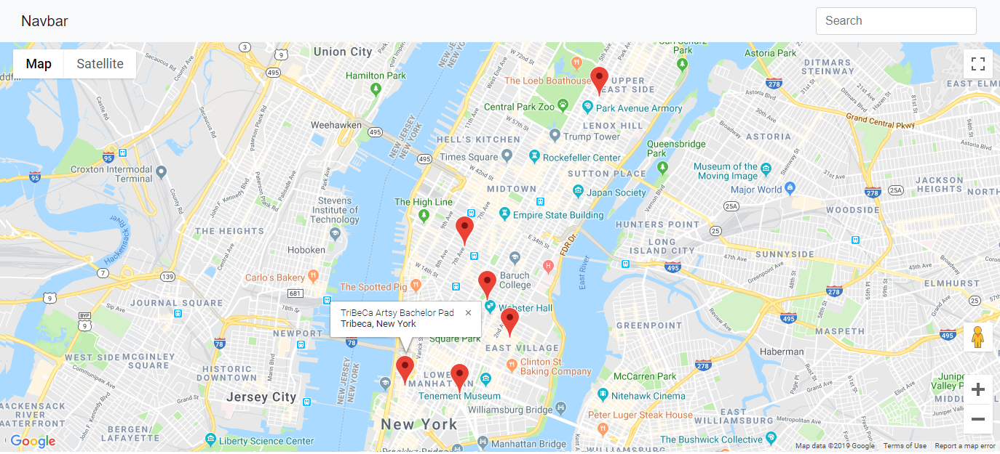

# Neighborhood Map
By Abdulrahman Elsharqawi, This project is supervised by Udacity's **[Full Stack Web Developer Nanodegree](https://www.udacity.com/course/nd004)**

## Code Sections
CSS - just one local CSS file that creates the page style. Bootstrap CSS is CDN based and not local, just easier to update as it is currently using **Bootstrap 4.1.3**. CSS file that is included is:
- `app.css` (Overwrites Bootstrap CSS for custom styling of app)

JS - the poject contains many js files, either local or using CDN
- `knockout-3.4.2.js` (Knockout framework)
- `jquery-3.2.1.min.js` (jQuery framework, using CDN)
- `app.js` (Main application file)
- `markers.js` (Contains myLocations to populate the map)

HTML - `Index.html` the main page that holds the map and the data-bindings

## Features
The application is simply a google map with some markers that shows you my favorite locations listed on both the map, and in a seperated view list. you can filter this list to show matched places based on your search.
The app uses knockout as a main tracker for the list and an updater when a change happens to the search field.

## APIs
Google Maps API is used here to show the map and generate the markers.

## How to run?
Clone or download this repo and simply open the index.html file, but be sure to be connected to the internet!
You can make modifications to the locations and add your own in the `js/markers.js` file.
